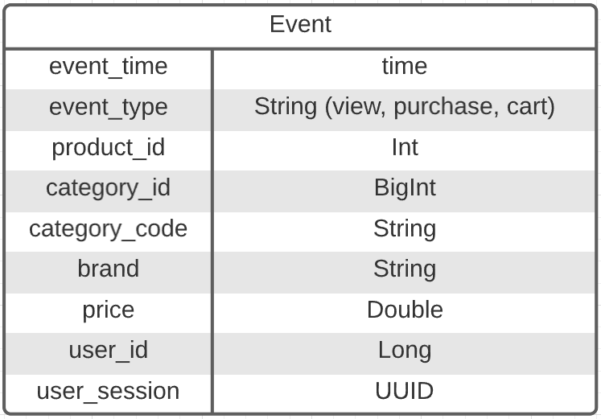

### Dataset Overview:

- https://www.kaggle.com/datasets/mkechinov/ecommerce-behavior-data-from-multi-category-store

The dataset has 9 columns with the following information:

  


### Cassandra cluster setup:

- https://blog.digitalis.io/containerized-cassandra-cluster-for-local-testing-60d24d70dcc4

  Following those steps I created a folder called config where I stored all the Cluster's Data. It's simple. First you create
  a container that saves all the configuration files to a local folder. Then you use (simple copy & paste) those 
  files to feed the cluster nodes you create. This makes the configuration of the cluster in
  the test environment easier. It works like a charm in my opinion and let you play around with each node's config 
  in the case you want to.


### App Overview:


#### Here we can distinguish some actors:
- ##### The Purple Actors:

  Are just common actors used at the beginning to populate the cassandra's cluster nodes with data from the dataset. You must uncomment their initialization in the main file
  in order to use them. In the /extra folder You have different size data samples to play with.(I've included the python script that I used to 
  transform the dataset files from .csv to .json there as well.)


- ##### The Orange Actors:

  These actors are in charge of every instance of the resources. For example, when we add a new user, the controller asks the users manager 
  to create a new user and after running some checks, the manager creates a new User Actor that holds the information
  related to that user.


- ##### The Red Actor:

  The controller actor containing all the routing directives that asks the managers about the requested resources
 
#### Endpoints (You can import this [postman collection](./extra/Project.postman_collection.json) to test it. )
```
/ecommerce

    /item
    GET / - List of all items
    POST / - Add item - required : Int id, String brand, String price, BigInt categoryId (optional)
    GET /{id} - View item
    PUT /{id} - Update item
    DELETE /{id} - Delete item
    
      /{id}/category
      PUT ?categoryId - Associates an existing Category to the given item  **
    
    /category
    GET / - List of all categories
    POST / - Add Category - required: id: BigInt, code:String
    GET /{id} - View Category
    PUT /{id} - Update Category
    DELETE /{id} - Delete Category
    
    /user
    GET / - List of all users
    POST / - Add user
    GET /{id} - View user info
    PUT /{id} - Update user
    DELETE /{id} - Delete user
      
      /{id}/purchase
      GET - List all purchases for a given user
      POST ?itemId - Stores a new purchase event
       
      /{id}/view
      GET - List all views for a given user
      POST ?itemId - Stores a new view event
       
      /{id}/cart
      GET - List all items in the cart for a given user
      POST - Purchases all the items in the cart
      POST ?itemId - Stores a new item in the cart
    
```
##### Todo:
- [x] Modify Await.result implementation in the managers. It can provoke thread starvation and it's not a
 good approach at all. I must check [this documentation](https://doc.akka.io/docs/akka/2.5.32/futures.html) (I still have some issues)
- [x] Review the View/Cart/Purchase definition and hashCode & equals implementation. Check [equals consistency](https://www.baeldung.com/java-equals-hashcode-contracts) 
   and how does the [HashSet works](https://docs.oracle.com/javase/7/docs/api/java/util/HashSet.html)
   (Those links refers to Java docs, but it's kinda the same for scala)
- [x]  I can change the "operationsCount" with the LastSequenceNumber (See [here](https://doc.akka.io/docs/akka/current/persistence.html))
- [x] Implement appropriate Failures in the Actor's companion objects. String-like failures are not an option, those
 messages must be typed and clearly defined.